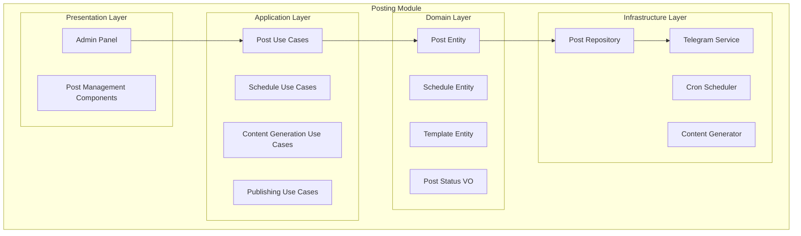
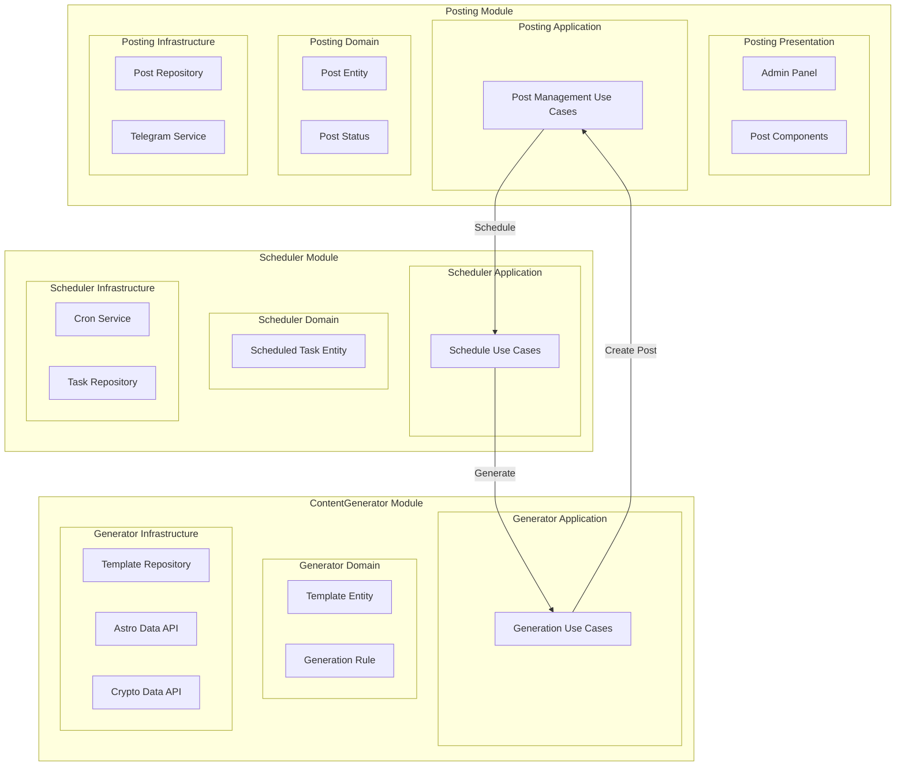
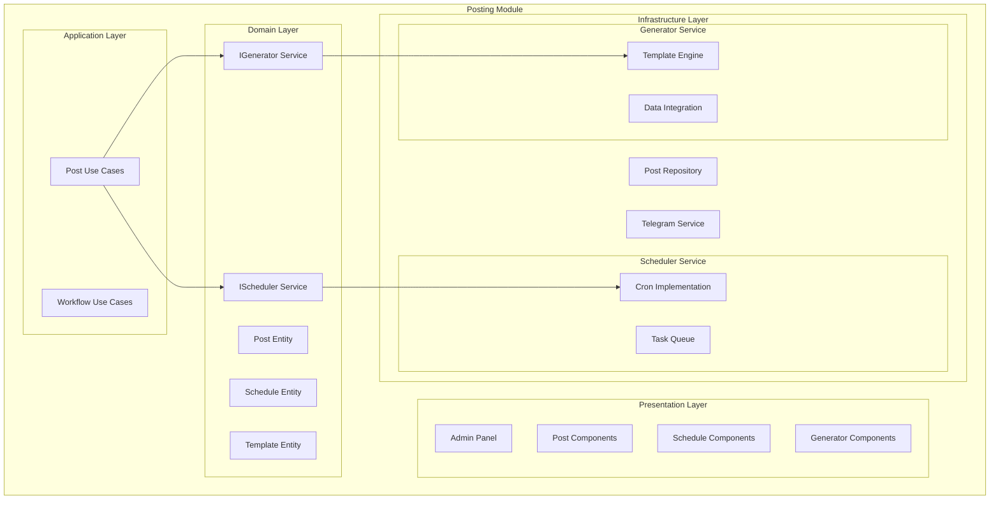
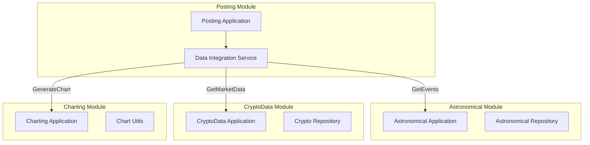

# 🎨🎨🎨 CREATIVE PHASE: АРХИТЕКТУРА СИСТЕМЫ ПОСТИНГА 🎨🎨🎨

## Метаданные
- **Дата создания:** 25.08.2025
- **Режим:** CREATIVE MODE
- **Тип Creative Phase:** Architecture Design
- **Компонент:** Posting System Architecture
- **Статус:** В процессе

## Проблема (Problem Statement)

### Определение проблемы
Необходимо спроектировать архитектуру системы автоматического постинга в Telegram-канал AstroBit, которая должна интегрироваться с существующей Clean Architecture проекта и обеспечивать:

1. **Автоматическое планирование** публикаций
2. **Генерацию контента** на основе астрономических и рыночных данных
3. **Управление workflow** постов (черновик → утверждение → публикация)
4. **Интеграцию** с Telegram Bot API
5. **Масштабируемость** и расширяемость системы

### Требования к архитектуре
- **Соответствие Clean Architecture** - следование существующим принципам проекта
- **Модульность** - возможность независимой разработки и тестирования
- **Интеграция** - бесшовная работа с Astronomical, CryptoData и Charting модулями
- **Надежность** - обработка ошибок и восстановление после сбоев
- **Производительность** - эффективная обработка больших объемов постов

### Ограничения
- **Технологический стек:** TypeScript, Node.js, React, Tailwind CSS
- **Хранилище:** JSON файлы (без SQL/NoSQL баз данных)
- **Внешние API:** Telegram Bot API, существующие API проекта
- **Архитектурные принципы:** Clean Architecture, DDD

## 🎨 CREATIVE CHECKPOINT: Анализ проблемы завершен

## Анализ вариантов (Options Analysis)

### Вариант 1: Монолитная архитектура в рамках одного модуля

**Описание:** Вся функциональность системы постинга размещается в единственном Posting модуле со всеми слоями внутри.

**Архитектурная диаграмма:**


**Pros:**
- Простота развертывания и управления
- Единая точка ответственности
- Быстрая разработка MVP
- Минимальная межмодульная коммуникация

**Cons:**
- Нарушение принципа Single Responsibility
- Сложность тестирования отдельных компонентов
- Проблемы масштабирования
- Сложность расширения функциональности

**Сложность:** Средняя  
**Время реализации:** 3-4 недели  
**Техническое соответствие:** Среднее (нарушает некоторые принципы Clean Architecture)

### Вариант 2: Микромодульная архитектура (3 отдельных модуля)

**Описание:** Разделение на три независимых модуля: Posting (управление постами), Scheduler (планировщик), ContentGenerator (генератор контента).

**Архитектурная диаграмма:**


**Pros:**
- Четкое разделение ответственности
- Независимое тестирование и разработка
- Легкость расширения каждого модуля
- Соответствие принципам Clean Architecture
- Возможность независимого масштабирования

**Cons:**
- Сложность межмодульного взаимодействия
- Больше времени на разработку
- Необходимость управления зависимостями
- Больше конфигурации

**Сложность:** Высокая  
**Время реализации:** 5-6 недель  
**Техническое соответствие:** Высокое

### Вариант 3: Гибридная архитектура с центральным модулем

**Описание:** Основной Posting модуль с выделенными сервисными компонентами для планирования и генерации контента внутри Infrastructure слоя.

**Архитектурная диаграмма:**


**Pros:**
- Баланс между простотой и модульностью
- Четкое разделение ответственности на уровне сервисов
- Соответствие Clean Architecture
- Управляемая сложность
- Возможность последующего выделения в отдельные модули

**Cons:**
- Средняя сложность межсервисного взаимодействия
- Требует четкой архитектуры интерфейсов
- Потенциальное разрастание Infrastructure слоя

**Сложность:** Средняя-Высокая  
**Время реализации:** 4-5 недель  
**Техническое соответствие:** Высокое

## 🎨 CREATIVE CHECKPOINT: Варианты проанализированы

## Оценка вариантов (Evaluation)

### Критерии оценки
1. **Соответствие Clean Architecture** (вес: 25%)
2. **Простота разработки и поддержки** (вес: 20%)
3. **Масштабируемость** (вес: 20%)
4. **Время реализации** (вес: 15%)
5. **Интеграция с существующими модулями** (вес: 10%)
6. **Тестируемость** (вес: 10%)

### Оценочная матрица

| Критерий | Вариант 1 | Вариант 2 | Вариант 3 |
|----------|-----------|-----------|-----------|
| Clean Architecture | 3/5 | 5/5 | 5/5 |
| Простота разработки | 5/5 | 2/5 | 4/5 |
| Масштабируемость | 2/5 | 5/5 | 4/5 |
| Время реализации | 5/5 | 2/5 | 3/5 |
| Интеграция | 4/5 | 3/5 | 4/5 |
| Тестируемость | 2/5 | 5/5 | 4/5 |
| **Взвешенная оценка** | **3.25** | **3.75** | **4.15** |

### Детальный анализ

#### Вариант 1 (Монолитный)
- ✅ Быстрая разработка
- ✅ Простая интеграция
- ❌ Низкая масштабируемость
- ❌ Сложность тестирования
- ❌ Нарушение архитектурных принципов

#### Вариант 2 (Микромодульный)
- ✅ Идеальное соответствие Clean Architecture
- ✅ Высокая масштабируемость
- ✅ Отличная тестируемость
- ❌ Высокая сложность разработки
- ❌ Долгое время реализации

#### Вариант 3 (Гибридный)
- ✅ Хорошее соответствие Clean Architecture
- ✅ Сбалансированная сложность
- ✅ Хорошая масштабируемость
- ✅ Приемлемое время реализации
- ✅ Возможность эволюции в Вариант 2

## Решение (Decision)

### Выбранный вариант: Вариант 3 - Гибридная архитектура

**Обоснование выбора:**
1. **Оптимальный баланс** между сложностью и функциональностью
2. **Соответствие принципам** Clean Architecture проекта
3. **Управляемое время разработки** (4-5 недель)
4. **Путь эволюции** - возможность последующего выделения сервисов в отдельные модули
5. **Высокие оценки** по всем критериям без критических недостатков

### Архитектурные решения

#### 1. Структура модуля
```typescript
src/Posting/
├── Domain/
│   ├── entities/
│   │   ├── Post.ts
│   │   ├── PostTemplate.ts
│   │   └── ScheduledTask.ts
│   ├── value-objects/
│   │   ├── PostStatus.ts
│   │   ├── PostType.ts
│   │   └── PostContent.ts
│   ├── services/
│   │   ├── ISchedulerService.ts
│   │   ├── IContentGeneratorService.ts
│   │   └── IPostWorkflowService.ts
│   └── repositories/
│       └── IPostRepository.ts
├── Application/
│   ├── use-cases/
│   │   ├── CreatePostUseCase.ts
│   │   ├── UpdatePostUseCase.ts
│   │   ├── SchedulePostUseCase.ts
│   │   ├── PublishPostUseCase.ts
│   │   └── GeneratePostContentUseCase.ts
│   └── services/
│       └── PostWorkflowService.ts
├── Infrastructure/
│   ├── repositories/
│   │   └── JsonFilePostRepository.ts
│   ├── services/
│   │   ├── telegram/
│   │   │   └── TelegramBotService.ts
│   │   ├── scheduler/
│   │   │   ├── CronSchedulerService.ts
│   │   │   └── TaskQueueService.ts
│   │   ├── generator/
│   │   │   ├── TemplateEngineService.ts
│   │   │   ├── ContentVariableResolver.ts
│   │   │   └── DataIntegrationService.ts
│   │   └── storage/
│   │       └── ImageStorageService.ts
│   └── data/
│       ├── posts.json
│       ├── templates.json
│       └── scheduled-tasks.json
└── Presentation/
    ├── components/
    │   ├── PostEditor.tsx
    │   ├── PostScheduler.tsx
    │   ├── PostHistory.tsx
    │   └── AdminPanel.tsx
    ├── containers/
    │   └── PostingContainer.tsx
    └── hooks/
        └── usePosting.ts
```

#### 2. Ключевые интерфейсы

```typescript
// Domain Services
interface ISchedulerService {
  schedulePost(postId: string, scheduledAt: Date): Promise<Result<void>>;
  cancelSchedule(postId: string): Promise<Result<void>>;
  getScheduledTasks(): Promise<Result<ScheduledTask[]>>;
}

interface IContentGeneratorService {
  generateFromTemplate(templateId: string, variables: Record<string, any>): Promise<Result<string>>;
  generateFromAstronomicalEvent(eventId: string): Promise<Result<string>>;
  generateMarketAnalysis(timeframe: string): Promise<Result<string>>;
}

interface IPostWorkflowService {
  moveToNextStatus(postId: string): Promise<Result<Post>>;
  canTransition(post: Post, targetStatus: PostStatus): boolean;
  getAvailableTransitions(post: Post): PostStatus[];
}
```

#### 3. Интеграция с существующими модулями



## 🎨 CREATIVE CHECKPOINT: Решение принято

## План реализации (Implementation Plan)

### Фаза 1: Основная инфраструктура (Неделя 1-2)
1. **Создание структуры модуля**
   - Настройка папок и базовых файлов
   - Создание основных интерфейсов
   - Настройка TypeScript конфигурации

2. **Domain Layer**
   - Реализация сущностей Post, PostTemplate, ScheduledTask
   - Создание value objects (PostStatus, PostType, PostContent)
   - Определение интерфейсов сервисов

3. **Infrastructure - Storage**
   - JsonFilePostRepository реализация
   - Схемы валидации JSON данных
   - Базовые CRUD операции

### Фаза 2: Core Services (Неделя 2-3)
1. **Telegram Integration**
   - TelegramBotService реализация
   - Обработка ошибок и retry логика
   - Настройка webhook/polling

2. **Scheduler Service**
   - CronSchedulerService реализация
   - TaskQueueService для управления очередью
   - Мониторинг выполнения задач

3. **Basic Application Layer**
   - Основные Use Cases
   - PostWorkflowService реализация
   - Интеграция с Repository

### Фаза 3: Content Generation (Неделя 3-4)
1. **Template Engine**
   - Парсер шаблонов
   - Система переменных
   - Валидация результатов

2. **Data Integration**
   - Интеграция с Astronomical Module
   - Интеграция с CryptoData Module
   - Интеграция с Charting Module

3. **Content Generator Service**
   - Генерация на основе событий
   - Генерация аналитических постов
   - Кастомизация контента

### Фаза 4: UI и завершение (Неделя 4-5)
1. **Presentation Layer**
   - Основные React компоненты
   - Интеграция с Tailwind CSS и Style Guide
   - Custom hooks для состояния

2. **Admin Panel**
   - Дашборд управления постами
   - Интерфейс планирования
   - Формы создания и редактирования

3. **Testing & Documentation**
   - Unit тесты для критических компонентов
   - Integration тесты
   - API документация

## Валидация (Validation)

### Соответствие требованиям
- ✅ **Clean Architecture**: Четкое разделение на слои с правильными зависимостями
- ✅ **Модульность**: Выделенные сервисы с четкими интерфейсами
- ✅ **Интеграция**: Определены точки интеграции с существующими модулями
- ✅ **Надежность**: Предусмотрена обработка ошибок и retry логика
- ✅ **Производительность**: Асинхронная обработка и очереди задач

### Техническая осуществимость
- ✅ **Технологический стек**: Соответствует существующему (TypeScript, Node.js, React)
- ✅ **JSON хранилище**: Реализуемо через файловую систему
- ✅ **Telegram API**: Интеграция через официальную библиотеку
- ✅ **Архитектурные принципы**: Полное соответствие Clean Architecture

### Оценка рисков
- 🟡 **Сложность межсервисного взаимодействия**: Решается через четкие интерфейсы
- 🟡 **Производительность JSON операций**: Решается через кэширование и оптимизацию
- 🟢 **Интеграция с существующими модулями**: Низкий риск благодаря использованию существующих интерфейсов

## 🎨🎨🎨 EXITING CREATIVE PHASE - АРХИТЕКТУРНОЕ РЕШЕНИЕ ПРИНЯТО 🎨🎨🎨

### Итоговое решение
**Выбрана гибридная архитектура** с центральным Posting модулем и выделенными сервисными компонентами для планирования и генерации контента. Архитектура обеспечивает оптимальный баланс между сложностью, функциональностью и соответствием принципам Clean Architecture.

### Готовность к реализации
- ✅ Архитектура детально спроектирована
- ✅ Структура модуля определена
- ✅ Интерфейсы сервисов описаны
- ✅ План реализации создан
- ✅ Интеграционные точки определены

**Следующий шаг:** Переход к дизайну UI/UX компонентов системы постинга.
