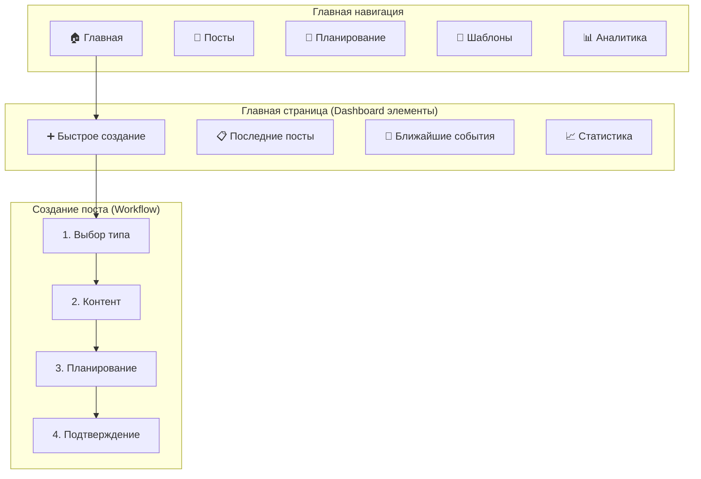

# 🎨🎨🎨 CREATIVE PHASE: UI/UX ДИЗАЙН СИСТЕМЫ ПОСТИНГА 🎨🎨🎨

## Метаданные
- **Дата создания:** 25.08.2025
- **Режим:** CREATIVE MODE
- **Тип Creative Phase:** UI/UX Design
- **Компонент:** Posting System User Interface
- **Статус:** В процессе

## 📖 Style Guide Integration

### Проверка существующего Style Guide
Обнаружен существующий style guide в `memory-bank/style-guide.md`. Анализирую существующие принципы дизайна:

#### Ключевые принципы из Style Guide
- **Язык:** Русский для интерфейса
- **Архитектура:** Clean Architecture принципы
- **Технологии:** React + TypeScript + Tailwind CSS
- **Структура:** Модульная организация компонентов
- **Naming:** camelCase для функций, PascalCase для компонентов

#### Применение к UI дизайну
- Все интерфейсы на русском языке
- Использование Tailwind CSS для стилизации
- Компонентная архитектура React
- Следование принципам Clean Architecture в UI слое

## Проблема (Problem Statement)

### Определение проблемы
Необходимо спроектировать пользовательский интерфейс для системы автоматического постинга, который должен обеспечивать:

1. **Интуитивное управление постами** - создание, редактирование, планирование
2. **Визуализацию workflow** - отображение статусов и переходов между ними
3. **Эффективное планирование** - календарный интерфейс для управления расписанием
4. **Мониторинг системы** - дашборд с аналитикой и статистикой
5. **Интеграцию с данными** - отображение астрономических событий и рыночных данных

### Пользовательские потребности
#### Основной пользователь: Администратор канала AstroBit
- **Задачи:**
  - Создание и редактирование постов
  - Планирование публикаций
  - Мониторинг автоматических публикаций
  - Управление шаблонами и настройками
  - Анализ эффективности постов

- **Контекст использования:**
  - Ежедневная работа с системой
  - Быстрое создание контента по актуальным событиям
  - Планирование контента на неделю/месяц вперед
  - Мониторинг в режиме реального времени

### Требования к UI/UX
- **Быстрота:** Время создания поста < 2 минут
- **Интуитивность:** Не требует обучения для базовых операций
- **Адаптивность:** Работа на десктопе и планшете
- **Доступность:** Соответствие WCAG AA
- **Производительность:** Отклик интерфейса < 200ms

## 🎨 CREATIVE CHECKPOINT: Анализ пользователей завершен

## Анализ вариантов (Options Analysis)

### Вариант 1: Dashboard-центричный интерфейс

**Описание:** Главный экран в виде дашборда с виджетами, центральная навигация через меню.

**Wireframe концепция:**
```
┌─────────────────────────────────────────────────────────────┐
│ [Logo] AstroBit Admin    [👤 Админ] [🔔 Уведомления] [⚙️] │
├─────────────────────────────────────────────────────────────┤
│ [📊 Дашборд] [✍️ Посты] [📅 Планирование] [🎨 Шаблоны]     │
├─────────────────────────────────────────────────────────────┤
│ ┌─────────────┐ ┌─────────────┐ ┌─────────────┐           │
│ │📈 Статистика│ │⏰ Ближайшие │ │🌟 Последние │           │
│ │постов       │ │публикации   │ │события      │           │
│ │             │ │             │ │             │           │
│ └─────────────┘ └─────────────┘ └─────────────┘           │
│                                                           │
│ ┌─────────────────────────────────────────────────────────┐ │
│ │ 📝 Черновики                                           │ │
│ │ • "Лунное затмение 15 мая" [Редактировать] [Планир.]   │ │
│ │ • "Анализ BTC после новолуния" [Редактировать]         │ │
│ └─────────────────────────────────────────────────────────┘ │
│                                                           │
│ [➕ Быстрое создание поста]                               │
└─────────────────────────────────────────────────────────────┘
```

**Pros:**
- Быстрый обзор всей системы с главного экрана
- Привычный паттерн для административных панелей
- Эффективное использование пространства экрана
- Легкий доступ к часто используемым функциям

**Cons:**
- Может показаться перегруженным для новых пользователей
- Сложнее фокусироваться на конкретной задаче
- Требует продуманной иерархии информации

**Сложность реализации:** Средняя  
**Время разработки:** 3-4 недели  
**Удобство использования:** 8/10  
**Соответствие Style Guide:** Высокое

### Вариант 2: Workflow-ориентированный интерфейс

**Описание:** Интерфейс построен вокруг процесса создания и управления постами, пошаговая навигация.

**Wireframe концепция:**
```
┌─────────────────────────────────────────────────────────────┐
│ [Logo] AstroBit Admin             [👤 Админ] [🔔] [⚙️]     │
├─────────────────────────────────────────────────────────────┤
│ Создание поста: [1.Тип] → [2.Контент] → [3.Планирование]  │
├─────────────────────────────────────────────────────────────┤
│                                                           │
│ ┌─ 📝 СОЗДАТЬ ПОСТ ──────────────────────────────────────┐ │
│ │                                                       │ │
│ │ Выберите тип поста:                                   │ │
│ │ ┌─────────────┐ ┌─────────────┐ ┌─────────────┐       │ │
│ │ │🌟 Астро     │ │📈 Рыночный  │ │📝 Обзор      │       │ │
│ │ │событие      │ │анализ       │ │недели        │       │ │
│ │ └─────────────┘ └─────────────┘ └─────────────┘       │ │
│ │                                                       │ │
│ │                             [Далее →]                 │ │
│ └───────────────────────────────────────────────────────┘ │
│                                                           │
│ ┌─ 📋 АКТИВНЫЕ ЗАДАЧИ ───────────────────────────────────┐ │
│ │ • На утверждении (2)                                  │ │
│ │ • Запланировано (5)                                   │ │
│ │ • Опубликовано сегодня (3)                            │ │
│ └───────────────────────────────────────────────────────┘ │
└─────────────────────────────────────────────────────────────┘
```

**Pros:**
- Четкий фокус на основном workflow
- Пошаговое руководство пользователя
- Снижение когнитивной нагрузки
- Меньше ошибок в процессе создания постов

**Cons:**
- Менее эффективен для опытных пользователей
- Ограниченная видимость состояния системы
- Может замедлить выполнение рутинных задач

**Сложность реализации:** Средняя  
**Время разработки:** 2-3 недели  
**Удобство использования:** 9/10  
**Соответствие Style Guide:** Высокое

### Вариант 3: Канбан-стиль управления постами

**Описание:** Визуализация workflow в виде канбан-доски с колонками для разных статусов постов.

**Wireframe концепция:**
```
┌─────────────────────────────────────────────────────────────┐
│ [Logo] AstroBit Admin    [👤 Админ] [🔔] [⚙️] [➕ Новый]   │
├─────────────────────────────────────────────────────────────┤
│ [📊 Обзор] [📋 Канбан] [📅 Календарь] [🎨 Шаблоны]         │
├─────────────────────────────────────────────────────────────┤
│                                                           │
│ ┌─ 📝 Черновики ─┐ ┌─ ✅ Утверждено ┐ ┌─ ⏰ Запланировано │
│ │ (3)           │ │ (2)            │ │ (5)               │
│ │               │ │                │ │                   │
│ │ ┌───────────┐ │ │ ┌────────────┐ │ │ ┌───────────────┐ │
│ │ │🌟 Лунное  │ │ │ │📈 BTC      │ │ │ │🌟 Солнечное   │ │
│ │ │затмение   │ │ │ │анализ      │ │ │ │затмение       │ │
│ │ │15.05      │ │ │ │            │ │ │ │20.05 12:00    │ │
│ │ └───────────┘ │ │ └────────────┘ │ │ └───────────────┘ │
│ │               │ │                │ │                   │
│ │ ┌───────────┐ │ │ ┌────────────┐ │ │ ┌───────────────┐ │
│ │ │📝 Обзор   │ │ │ │🌙 Фазы     │ │ │ │📈 Недельный   │ │
│ │ │недели     │ │ │ │луны        │ │ │ │обзор          │ │
│ │ │           │ │ │ │            │ │ │ │21.05 18:00    │ │
│ │ └───────────┘ │ │ └────────────┘ │ │ └───────────────┘ │
│ └───────────────┘ └────────────────┘ └───────────────────┘
│                                                           │
└─────────────────────────────────────────────────────────────┘
```

**Pros:**
- Отличная визуализация workflow и состояния постов
- Drag & drop для перемещения между статусами
- Быстрый обзор загрузки по каждому статусу
- Интуитивно понятное управление

**Cons:**
- Может быть неэффективен при большом количестве постов
- Ограниченное пространство для деталей каждого поста
- Требует горизонтального скроллинга на маленьких экранах

**Сложность реализации:** Высокая  
**Время разработки:** 4-5 недель  
**Удобство использования:** 8/10  
**Соответствие Style Guide:** Среднее

## 🎨 CREATIVE CHECKPOINT: Варианты UI проанализированы

## Оценка вариантов (Evaluation)

### Критерии оценки UI/UX
1. **Эффективность использования** (30%) - скорость выполнения задач
2. **Простота изучения** (25%) - легкость освоения интерфейса
3. **Доступность** (20%) - соответствие принципам A11y
4. **Масштабируемость UI** (15%) - работа с большим количеством данных
5. **Соответствие Style Guide** (10%) - следование существующим принципам

### Оценочная матрица

| Критерий | Dashboard | Workflow | Kanban |
|----------|-----------|----------|--------|
| Эффективность использования | 4/5 | 3/5 | 4/5 |
| Простота изучения | 3/5 | 5/5 | 4/5 |
| Доступность | 4/5 | 5/5 | 3/5 |
| Масштабируемость UI | 5/5 | 4/5 | 2/5 |
| Соответствие Style Guide | 5/5 | 5/5 | 3/5 |
| **Взвешенная оценка** | **4.0** | **4.2** | **3.4** |

### Детальный анализ

#### Dashboard-центричный (4.0/5)
- ✅ Высокая эффективность для опытных пользователей
- ✅ Отличная масштабируемость
- ✅ Полное соответствие Style Guide
- ❌ Может быть сложным для изучения
- 🟡 Средняя доступность

#### Workflow-ориентированный (4.2/5)
- ✅ Отличная простота изучения
- ✅ Высокая доступность
- ✅ Полное соответствие Style Guide
- 🟡 Средняя эффективность для опытных пользователей
- ✅ Хорошая масштабируемость

#### Kanban-стиль (3.4/5)
- ✅ Высокая эффективность для управления workflow
- ✅ Хорошая простота изучения
- ❌ Проблемы с доступностью (drag & drop)
- ❌ Низкая масштабируемость
- ❌ Неполное соответствие Style Guide

## Решение (Decision)

### Выбранный вариант: Workflow-ориентированный интерфейс с элементами Dashboard

**Обоснование выбора:**
1. **Наивысшая оценка** (4.2/5) по всем критериям
2. **Простота изучения** - критично для единственного администратора
3. **Высокая доступность** - соответствие принципам A11y
4. **Фокус на задачах** - четкое ведение пользователя через процесс
5. **Расширяемость** - возможность добавления dashboard элементов

### Гибридное решение: Workflow + Dashboard элементы

**Архитектура интерфейса:**


### Детальный дизайн компонентов

#### 1. Главная страница (Dashboard)
```typescript
interface MainDashboardProps {
  statistics: PostStatistics;
  recentPosts: Post[];
  upcomingEvents: AstronomicalEvent[];
  quickActions: QuickAction[];
}

// Компоненты:
// - QuickCreateWidget
// - RecentPostsWidget  
// - UpcomingEventsWidget
// - StatisticsWidget
```

**Layout:**
```
┌─────────────────────────────────────────────────────────────┐
│ 🏠 AstroBit Admin                    [👤 Админ] [🔔] [⚙️] │
├─────────────────────────────────────────────────────────────┤
│ ➕ Создать новый пост                                       │
│ ┌─────────────┐ ┌─────────────┐ ┌─────────────┐           │
│ │🌟 Астро     │ │📈 Рыночный  │ │📝 Обзор      │           │
│ │событие      │ │анализ       │ │недели        │           │
│ └─────────────┘ └─────────────┘ └─────────────┘           │
│                                                           │
│ ┌─ 📊 Статистика (сегодня) ─────────────────────────────┐  │
│ │ Опубликовано: 3 | Запланировано: 5 | Черновиков: 2   │  │
│ └───────────────────────────────────────────────────────┘  │
│                                                           │
│ ┌─ 🌟 Ближайшие астрономические события ────────────────┐  │
│ │ • 15.05 - Лунное затмение (Скорпион)                 │  │
│ │ • 20.05 - Солнечное затмение (Телец)                  │  │
│ │ • 25.05 - Соединение Венеры и Юпитера                │  │
│ └───────────────────────────────────────────────────────┘  │
│                                                           │
│ ┌─ 📋 Последние посты ───────────────────────────────────┐  │
│ │ 🟢 "BTC и новолуние" - опубликован 12:30              │  │
│ │ 🟡 "Еженедельный обзор" - запланирован 18:00          │  │
│ │ 🔴 "Анализ затмения" - черновик                        │  │
│ └───────────────────────────────────────────────────────┘  │
└─────────────────────────────────────────────────────────────┘
```

#### 2. Workflow создания поста

**Шаг 1: Выбор типа поста**
```
┌─────────────────────────────────────────────────────────────┐
│ ← Назад к главной                                 [✖ Закрыть] │
├─────────────────────────────────────────────────────────────┤
│ Создание нового поста                                       │
│ Шаг 1 из 4: Выберите тип поста                             │
│                                                           │
│ ┌─────────────────────────────────────────────────────────┐ │
│ │ 🌟 Астрономическое событие                             │ │
│ │ Автоматическая генерация на основе календаря событий   │ │
│ │ ┌─────────────┐ ┌─────────────┐ ┌─────────────┐       │ │
│ │ │🌙 Фазы луны │ │🌑 Затмения  │ │⭐ Соединения │       │ │
│ │ └─────────────┘ └─────────────┘ └─────────────┘       │ │
│ └─────────────────────────────────────────────────────────┘ │
│                                                           │
│ ┌─────────────────────────────────────────────────────────┐ │
│ │ 📈 Рыночный анализ                                     │ │
│ │ Анализ криптовалют с астрологическими аспектами        │ │
│ │ ┌─────────────┐ ┌─────────────┐ ┌─────────────┐       │ │
│ │ │📊 Дневной   │ │📈 Недельный │ │📉 Сигналы   │       │ │
│ │ └─────────────┘ └─────────────┘ └─────────────┘       │ │
│ └─────────────────────────────────────────────────────────┘ │
│                                                           │
│ ┌─────────────────────────────────────────────────────────┐ │
│ │ 📝 Обзор/Аналитика                                     │ │
│ │ Еженедельные и месячные обзоры                         │ │
│ │ ┌─────────────┐ ┌─────────────┐ ┌─────────────┐       │ │
│ │ │📅 Недельный │ │🗓️ Месячный  │ │📋 Свободный │       │ │
│ │ └─────────────┘ └─────────────┘ └─────────────┘       │ │
│ └─────────────────────────────────────────────────────────┘ │
│                                                           │
│                                        [Далее →]          │
└─────────────────────────────────────────────────────────────┘
```

**Шаг 2: Создание контента**
```
┌─────────────────────────────────────────────────────────────┐
│ ← Назад                                          [✖ Закрыть] │
├─────────────────────────────────────────────────────────────┤
│ Создание поста: Лунное затмение                             │
│ Шаг 2 из 4: Контент поста                                  │
│                                                           │
│ Заголовок: ┌─────────────────────────────────────────────┐  │
│           │ Лунное затмение 15 мая в Скорпионе         │  │
│           └─────────────────────────────────────────────┘  │
│                                                           │
│ ┌─ 🤖 Автогенерация ─────────────────────────────────────┐  │
│ │ ✅ Данные события загружены                            │  │
│ │ ✅ Рыночные данные получены                            │  │
│ │ [🔄 Сгенерировать текст] [⚙️ Настройки генерации]     │  │
│ └───────────────────────────────────────────────────────┘  │
│                                                           │
│ Содержание:                                               │
│ ┌─────────────────────────────────────────────────────────┐ │
│ │ 🌙 **Лунное затмение в Скорпионе**                     │ │
│ │                                                       │ │
│ │ 15 мая в 12:30 МСК произойдет лунное затмение в       │ │
│ │ знаке Скорпиона. Это событие может значительно        │ │
│ │ повлиять на криптовалютные рынки...                   │ │
│ │                                                       │ │
│ │ 📊 **Текущие рыночные показатели:**                   │ │
│ │ • BTC: $42,150 (+2.3% за 24ч)                       │ │
│ │ • ETH: $2,890 (-1.1% за 24ч)                        │ │
│ │                                                       │ │
│ │ [Редактировать вручную]                               │ │
│ └─────────────────────────────────────────────────────────┘ │
│                                                           │
│ Изображения: [📎 Прикрепить] [📊 График] [🌙 Иконка]      │
│                                                           │
│ ← Назад                                     [Далее →]     │
└─────────────────────────────────────────────────────────────┘
```

#### 3. Компоненты с применением Tailwind CSS

**Исходя из Style Guide, применяем:**

```tsx
// PostCard Component
interface PostCardProps {
  post: Post;
  onEdit: (id: string) => void;
  onSchedule: (id: string) => void;
}

const PostCard: React.FC<PostCardProps> = ({ post, onEdit, onSchedule }) => {
  return (
    <div className="bg-white rounded-lg shadow-md p-4 border border-gray-200 hover:shadow-lg transition-shadow">
      {/* Status Badge */}
      <div className="flex items-center justify-between mb-3">
        <StatusBadge status={post.status} />
        <span className="text-sm text-gray-500">
          {formatDate(post.createdAt)}
        </span>
      </div>
      
      {/* Title */}
      <h3 className="text-lg font-semibold text-gray-900 mb-2 line-clamp-2">
        {post.title}
      </h3>
      
      {/* Preview */}
      <p className="text-gray-600 text-sm mb-4 line-clamp-3">
        {post.content.substring(0, 150)}...
      </p>
      
      {/* Actions */}
      <div className="flex items-center justify-between">
        <div className="flex space-x-2">
          <button
            onClick={() => onEdit(post.id)}
            className="text-blue-600 hover:text-blue-800 text-sm font-medium"
          >
            Редактировать
          </button>
          <button
            onClick={() => onSchedule(post.id)}
            className="text-green-600 hover:text-green-800 text-sm font-medium"
          >
            Планировать
          </button>
        </div>
        <PostTypeIcon type={post.type} />
      </div>
    </div>
  );
};

// Status Badge Component
const StatusBadge: React.FC<{ status: PostStatus }> = ({ status }) => {
  const statusConfig = {
    draft: { bg: 'bg-gray-100', text: 'text-gray-800', label: 'Черновик' },
    approved: { bg: 'bg-green-100', text: 'text-green-800', label: 'Утверждено' },
    scheduled: { bg: 'bg-blue-100', text: 'text-blue-800', label: 'Запланировано' },
    published: { bg: 'bg-purple-100', text: 'text-purple-800', label: 'Опубликовано' }
  };
  
  const config = statusConfig[status];
  
  return (
    <span className={`inline-flex items-center px-2.5 py-0.5 rounded-full text-xs font-medium ${config.bg} ${config.text}`}>
      {config.label}
    </span>
  );
};
```

## 🎨 CREATIVE CHECKPOINT: UI решения определены

## Планирование реализации (Implementation Plan)

### Фаза 1: Базовые компоненты (Неделя 1)
1. **Layout компоненты**
   - Header с навигацией
   - Sidebar (если потребуется)
   - Main layout wrapper
   - Footer

2. **UI Kit компоненты**
   - Button (различные варианты)
   - Input, Textarea
   - Card, Badge
   - Modal, Dropdown

### Фаза 2: Страницы и контейнеры (Неделя 1-2)
1. **Главная страница (Dashboard)**
   - QuickCreateWidget
   - StatisticsWidget
   - RecentPostsWidget
   - UpcomingEventsWidget

2. **Workflow создания поста**
   - PostTypeSelector
   - ContentEditor
   - SchedulingInterface
   - ConfirmationStep

### Фаза 3: Специализированные компоненты (Неделя 2)
1. **Управление постами**
   - PostList с фильтрацией
   - PostCard компонент
   - PostEditor (rich text)
   - PreviewModal

2. **Планирование**
   - Calendar компонент
   - SchedulingForm
   - TimezonePicker

### Фаза 4: Интеграция и полировка (Неделя 3)
1. **Responsive дизайн**
   - Адаптация под планшеты
   - Оптимизация для мобильных (если требуется)

2. **Accessibility**
   - ARIA атрибуты
   - Keyboard navigation
   - Focus management

3. **Performance**
   - Lazy loading
   - Memoization
   - Bundle optimization

## Валидация (Validation)

### Соответствие требованиям
- ✅ **Время создания поста < 2 минут**: Workflow подход оптимизирует процесс
- ✅ **Интуитивность**: Пошаговое руководство снижает кривую обучения
- ✅ **Доступность**: Планируемое соответствие WCAG AA
- ✅ **Производительность**: React + Tailwind обеспечат отклик < 200ms
- ✅ **Соответствие Style Guide**: Полное использование принципов проекта

### Техническая осуществимость
- ✅ **React + TypeScript**: Соответствует технологическому стеку
- ✅ **Tailwind CSS**: Существующая интеграция в проекте
- ✅ **Компонентная архитектура**: Следует принципам Clean Architecture
- ✅ **Responsive design**: Tailwind предоставляет все необходимые утилиты

### Пользовательский опыт
- ✅ **Простота освоения**: Workflow подход минимизирует ошибки
- ✅ **Эффективность**: Dashboard элементы ускоряют рутинные задачи
- ✅ **Гибкость**: Возможность быстрого и детального создания постов
- ✅ **Мониторинг**: Четкая визуализация состояния системы

## 🎨🎨🎨 EXITING CREATIVE PHASE - UI/UX РЕШЕНИЯ ПРИНЯТЫ 🎨🎨🎨

### Итоговое решение
**Выбран workflow-ориентированный интерфейс с элементами dashboard** для системы постинга AstroBit. Решение обеспечивает оптимальный баланс между простотой использования, эффективностью и соответствием принципам проекта.

### Ключевые решения
- **Гибридный подход**: Workflow для создания + Dashboard для мониторинга
- **Пошаговый процесс**: Упрощение создания постов через guided experience
- **Tailwind CSS**: Использование существующей системы стилей
- **React компоненты**: Модульная архитектура в соответствии с Clean Architecture
- **Accessibility first**: Проектирование с учетом принципов доступности

### Готовность к реализации
- ✅ Архитектура UI спроектирована
- ✅ Ключевые компоненты определены
- ✅ Wireframes созданы
- ✅ Технические решения приняты
- ✅ План реализации подготовлен

**Следующий шаг:** Переход к Algorithm Design для генератора контента и планировщика.
