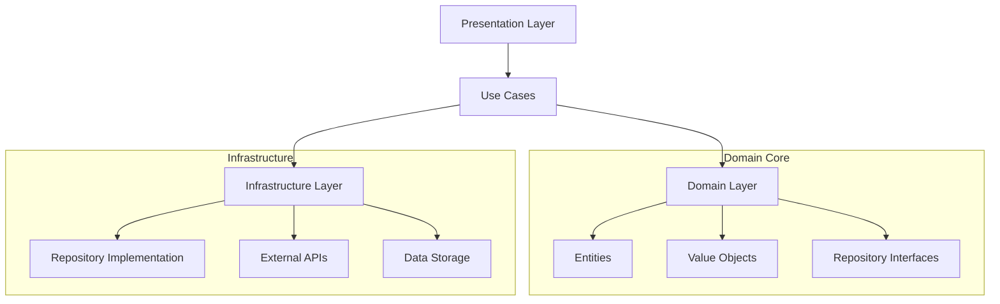

# Системные паттерны AstroBit

## Архитектурные принципы системы постинга и аналитики

### 1. AI-First Architecture
**Принцип**: ИИ интегрирован на архитектурном уровне как первоклассный компонент
- **Обоснование**: Качество контента напрямую зависит от качества AI интеграции
- **Реализация**: Выделенные сервисы (AIContentService, PromptManager)
- **Паттерны**: Strategy для разных типов генерации, Chain of Responsibility для обработки промптов

### 2. Content Lifecycle Management
**Принцип**: Контент проходит через четко определенные стадии жизненного цикла
- **Стадии**: Draft → Scheduled → Published → Archived
- **Переходы**: Управляются state machine с валидацией
- **Архивирование**: Автоматическое с ротацией по времени/объему

### 3. Contextual Content Generation
**Принцип**: Генерация контента основана на историческом контексте и связях
- **Источники контекста**: Исторические посты, астрономические события, рыночные данные
- **Связывание**: Система тегов для семантических связей
- **Персонализация**: Адаптация под тип контента и аудиторию

## Основные архитектурные паттерны

### Clean Architecture (Hexagonal)
Проект следует принципам Clean Architecture с четким разделением на слои:



**Применение в системе постинга:**
- **Domain**: Post, Tag, ContentTemplate entities
- **Use Cases**: GeneratePostUseCase, ArchivePostsUseCase
- **Infrastructure**: JsonPostRepository, OpenAIContentService
- **Presentation**: PostManagementContainer, ContentGeneratorComponent

### Repository Pattern
Абстракция доступа к данным с поддержкой multiple storage backends:

```typescript
interface IPostRepository {
  save(post: Post): Promise<Result<Post>>;
  findById(id: string): Promise<Result<Post>>;
  findByTags(tags: string[]): Promise<Result<Post[]>>;
  findByDateRange(start: Date, end: Date): Promise<Result<Post[]>>;
  archive(posts: Post[]): Promise<Result<void>>;
}

// Реализации
class JsonPostRepository implements IPostRepository
class DatabasePostRepository implements IPostRepository  
class ArchivePostRepository implements IPostRepository
```

### Factory Pattern для Content Generation
Фабрика для создания различных типов генераторов контента:

```typescript
interface IContentGenerator {
  generate(context: GenerationContext): Promise<Result<string>>;
}

class ContentGeneratorFactory {
  createGenerator(type: PostType): IContentGenerator {
    switch(type) {
      case 'astronomical_announcement': 
        return new AstronomicalAnnouncementGenerator();
      case 'market_retrospective':
        return new MarketRetrospectiveGenerator();
      case 'analytical_post':
        return new AnalyticalPostGenerator();
    }
  }
}
```

### Strategy Pattern для AI Prompts
Различные стратегии генерации контента в зависимости от типа поста:

```typescript
interface IPromptStrategy {
  buildPrompt(context: GenerationContext): string;
}

class AstronomicalEventPromptStrategy implements IPromptStrategy {
  buildPrompt(context: GenerationContext): string {
    return `Создай анонс астрономического события ${context.event.name}...`;
  }
}

class MarketAnalysisPromptStrategy implements IPromptStrategy {
  buildPrompt(context: GenerationContext): string {
    return `Проанализируй динамику рынка за период ${context.period}...`;
  }
}
```

### Observer Pattern для Content Events
Система событий для уведомления о изменениях контента:

```typescript
interface IContentEventObserver {
  onPostGenerated(post: Post): void;
  onPostPublished(post: Post): void;
  onPostArchived(post: Post): void;
}

class TelegramPublisher implements IContentEventObserver {
  onPostPublished(post: Post): void {
    this.telegramService.sendPost(post);
  }
}

class AnalyticsTracker implements IContentEventObserver {
  onPostGenerated(post: Post): void {
    this.trackEvent('post_generated', post.metadata);
  }
}
```

### Command Pattern для Content Operations
Все операции с контентом как команды для undo/redo и батчинга:

```typescript
interface IContentCommand {
  execute(): Promise<Result<void>>;
  undo(): Promise<Result<void>>;
}

class GeneratePostCommand implements IContentCommand {
  constructor(
    private generator: IContentGenerator,
    private context: GenerationContext
  ) {}
  
  async execute(): Promise<Result<void>> {
    const content = await this.generator.generate(this.context);
    this.generatedPost = Post.create(/*...*/);
    return this.postRepository.save(this.generatedPost);
  }
}

class BatchArchiveCommand implements IContentCommand {
  constructor(private posts: Post[]) {}
  
  async execute(): Promise<Result<void>> {
    return this.archiveService.archivePosts(this.posts);
  }
}
```

## Система архивирования и ротации

### Archive Strategy Pattern
Различные стратегии архивирования:

```typescript
interface IArchiveStrategy {
  shouldArchive(posts: Post[]): boolean;
  createArchiveName(): string;
  execute(posts: Post[]): Promise<Result<void>>;
}

class TimeBasedArchiveStrategy implements IArchiveStrategy {
  shouldArchive(posts: Post[]): boolean {
    return posts.some(p => 
      differenceInMonths(new Date(), p.publishedAt) > 3
    );
  }
}

class SizeBasedArchiveStrategy implements IArchiveStrategy {
  shouldArchive(posts: Post[]): boolean {
    return posts.length > 200;
  }
}
```

### Chain of Responsibility для Archive Processing
Цепочка обработчиков для различных этапов архивирования:

```typescript
abstract class ArchiveHandler {
  protected next?: ArchiveHandler;
  
  setNext(handler: ArchiveHandler): ArchiveHandler {
    this.next = handler;
    return handler;
  }
  
  abstract handle(posts: Post[]): Promise<Result<Post[]>>;
}

class ValidationHandler extends ArchiveHandler {
  async handle(posts: Post[]): Promise<Result<Post[]>> {
    const validPosts = posts.filter(this.isValidForArchive);
    return this.next?.handle(validPosts) ?? Result.ok(validPosts);
  }
}

class BackupHandler extends ArchiveHandler {
  async handle(posts: Post[]): Promise<Result<Post[]>> {
    await this.createBackup(posts);
    return this.next?.handle(posts) ?? Result.ok(posts);
  }
}
```

## Система тегов и связей

### Tag System Architecture
Система тегов для семантических связей между постами:

```typescript
class Tag extends ValueObject<{tag: string, category: string}> {
  static create(tag: string, category: string): Tag {
    return new Tag({tag, category});
  }
  
  static astronomical(event: string): Tag {
    return Tag.create(event, 'astronomical');
  }
  
  static market(symbol: string): Tag {
    return Tag.create(symbol, 'market');
  }
}

class PostTagRelation {
  constructor(
    public postId: string,
    public tags: Tag[],
    public weight: number = 1.0
  ) {}
}
```

### Semantic Search Service
Поиск связанных постов по семантическим тегам:

```typescript
class SemanticSearchService {
  async findRelatedPosts(
    tags: Tag[], 
    limit: number = 10
  ): Promise<Result<Post[]>> {
    const relatedPosts = await this.postRepository.findByTags(
      tags.map(t => t.value.tag)
    );
    
    return Result.ok(
      this.rankByRelevance(relatedPosts.value, tags)
        .slice(0, limit)
    );
  }
  
  private rankByRelevance(posts: Post[], tags: Tag[]): Post[] {
    return posts.sort((a, b) => {
      const scoreA = this.calculateRelevanceScore(a, tags);
      const scoreB = this.calculateRelevanceScore(b, tags);
      return scoreB - scoreA;
    });
  }
}
```

## Error Handling Patterns

### Result Pattern для надежности
Использование Result pattern вместо exceptions:

```typescript
type Result<T> = {
  isSuccess: boolean;
  value?: T;
  error?: Error;
}

class ContentGenerationService {
  async generatePost(context: GenerationContext): Promise<Result<Post>> {
    try {
      const openAIResult = await this.openAIService.generate(context);
      if (!openAIResult.isSuccess) {
        return Result.failure(openAIResult.error);
      }
      
      const post = Post.create(/*...*/);
      const saveResult = await this.postRepository.save(post);
      
      return saveResult.isSuccess 
        ? Result.success(post)
        : Result.failure(saveResult.error);
        
    } catch (error) {
      return Result.failure(new Error(`Generation failed: ${error.message}`));
    }
  }
}
```

### Circuit Breaker для External APIs
Защита от сбоев внешних сервисов:

```typescript
class CircuitBreakerOpenAIService {
  private failureCount = 0;
  private lastFailureTime?: Date;
  private readonly threshold = 5;
  private readonly timeout = 60000; // 1 минута
  
  async generate(prompt: string): Promise<Result<string>> {
    if (this.isOpen()) {
      return Result.failure(new Error('Circuit breaker is open'));
    }
    
    try {
      const result = await this.openAIClient.generate(prompt);
      this.onSuccess();
      return Result.success(result);
    } catch (error) {
      this.onFailure();
      return Result.failure(error);
    }
  }
  
  private isOpen(): boolean {
    return this.failureCount >= this.threshold &&
           Date.now() - this.lastFailureTime.getTime() < this.timeout;
  }
}
```

## Performance Patterns

### Lazy Loading для больших JSON файлов
Отложенная загрузка архивных данных:

```typescript
class LazyArchiveRepository {
  private cache = new Map<string, Post[]>();
  
  async getArchive(month: string): Promise<Result<Post[]>> {
    if (this.cache.has(month)) {
      return Result.success(this.cache.get(month));
    }
    
    const posts = await this.loadArchiveFile(`archive_${month}.json`);
    if (posts.isSuccess) {
      this.cache.set(month, posts.value);
    }
    
    return posts;
  }
}
```

### Memoization для expensive операций
Кэширование результатов генерации:

```typescript
class MemoizedContentGenerator {
  private cache = new Map<string, string>();
  
  async generate(context: GenerationContext): Promise<Result<string>> {
    const cacheKey = this.createCacheKey(context);
    
    if (this.cache.has(cacheKey)) {
      return Result.success(this.cache.get(cacheKey));
    }
    
    const result = await this.openAIService.generate(context);
    if (result.isSuccess) {
      this.cache.set(cacheKey, result.value);
    }
    
    return result;
  }
}
```

## Integration Patterns

### Adapter Pattern для External APIs
Адаптеры для унификации внешних API:

```typescript
interface IAstronomicalDataAdapter {
  getUpcomingEvents(days: number): Promise<Result<AstronomicalEvent[]>>;
}

class LocalJsonAdapter implements IAstronomicalDataAdapter {
  async getUpcomingEvents(days: number): Promise<Result<AstronomicalEvent[]>> {
    const events = await this.loadLocalData();
    const upcoming = this.filterUpcoming(events.value, days);
    return Result.success(upcoming);
  }
}

class ExternalAPIAdapter implements IAstronomicalDataAdapter {
  async getUpcomingEvents(days: number): Promise<Result<AstronomicalEvent[]>> {
    const response = await this.externalAPI.getEvents(days);
    const events = this.mapToInternalFormat(response);
    return Result.success(events);
  }
}
```

### Facade Pattern для сложных операций
Упрощение сложных операций генерации контента:

```typescript
class ContentGenerationFacade {
  constructor(
    private astronomicalAdapter: IAstronomicalDataAdapter,
    private marketDataService: IMarketDataService,
    private contentGenerator: IContentGenerator,
    private postRepository: IPostRepository
  ) {}
  
  async generateAstronomicalAnnouncement(
    eventId: string,
    selectedHistoricalPosts: string[]
  ): Promise<Result<Post>> {
    // 1. Получаем данные о событии
    const event = await this.astronomicalAdapter.getEventById(eventId);
    
    // 2. Получаем исторический контекст
    const historicalPosts = await this.getHistoricalPosts(selectedHistoricalPosts);
    
    // 3. Получаем рыночные данные
    const marketData = await this.marketDataService.getCurrentData();
    
    // 4. Формируем контекст генерации
    const context = new GenerationContext({
      event: event.value,
      historicalPosts: historicalPosts.value,
      marketData: marketData.value
    });
    
    // 5. Генерируем контент
    const content = await this.contentGenerator.generate(context);
    
    // 6. Создаем и сохраняем пост
    const post = Post.create(/*...*/);
    return this.postRepository.save(post);
  }
}
```

## Валидация и Quality Gates

### Validation Pipeline
Пайплайн валидации для сгенерированного контента:

```typescript
interface IContentValidator {
  validate(content: string): ValidationResult;
}

class ContentValidationPipeline {
  private validators: IContentValidator[] = [];
  
  addValidator(validator: IContentValidator): this {
    this.validators.push(validator);
    return this;
  }
  
  validate(content: string): ValidationResult {
    for (const validator of this.validators) {
      const result = validator.validate(content);
      if (!result.isValid) {
        return result;
      }
    }
    return ValidationResult.success();
  }
}

// Конкретные валидаторы
class LengthValidator implements IContentValidator
class ProfanityValidator implements IContentValidator  
class AstronomicalFactValidator implements IContentValidator
```

Эти паттерны обеспечивают масштабируемость, поддерживаемость и надежность системы автоматического постинга с ИИ, интегрируясь с существующей архитектурой проекта AstroBit.
